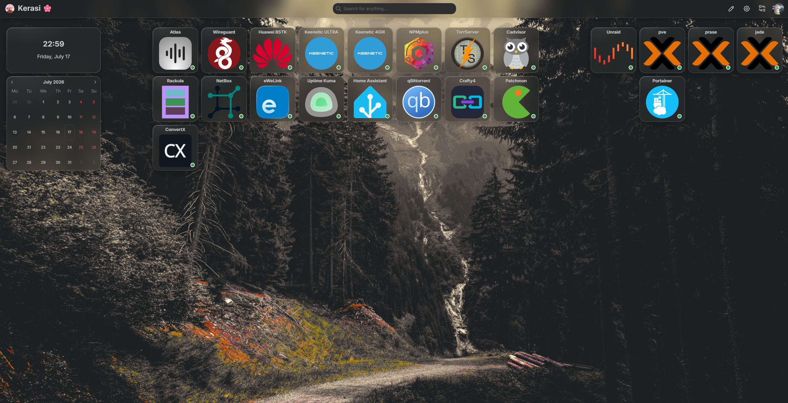
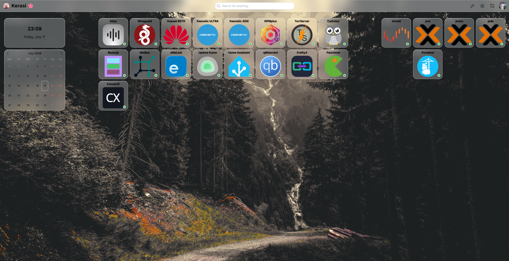

# homarr-css

Кастомная тема оформления для дашборда [Homarr](https://homarr.dev) - «жидкое стекло» (liquid / frosted glass): матовые полупрозрачные плитки и шапка с размытием фона, аккуратной кромкой и бликами, аккуратная типографика заголовков и адаптация под светлую/тёмную темы.

Протестировано на Homarr `v1.71.0`.





## Что делает тема

- **Матовое стекло** на всех плитках и на шапке (`backdrop-filter: blur`) - сквозь них просвечивает и размывается фон доски.
- **Единый визуальный язык:** скруглённые углы, тонкая светлая кромка, мягкая тень, лёгкий блик сверху-слева, подсветка при наведении.
- **Порядок в содержимом плиток:** иконки не «прыгают» на hover, длинные названия переносятся, а не обрезаются.
- **Поддержка светлой и тёмной темы** (через атрибут `data-mantine-color-scheme`).
- **Обход бага Chromium** с полосой-призраком под шапкой (см. ниже).

## Установка

Homarr → **Manage → Settings → Customization → Custom CSS** (или соответствующий раздел кастомного CSS в вашей версии), вставить содержимое [`style.css`](style.css) и сохранить.

Тема опирается на классы Mantine/Homarr (`.mantine-AppShell-*`, `.grid-stack-item-content`, `.app-*` и т.п.). При крупном обновлении Homarr классы или CSS-хэши могут измениться - тогда правила нужно сверить.

## Известный баг Chromium: полоса-призрак под шапкой

**Симптом.** На узких экранах (< ~530px) под нижней кромкой шапки появлялась полупрозрачная горизонтальная полоса («два слоя стекла»), заметная при движении курсора/hover и пропадавшая в режиме инспектора DevTools.

**Причина.** Баг композитора Chromium: `backdrop-filter` плиток рисует полупрозрачный **дубликат нижней кромки закреплённой (`position: fixed`) шапки**. Призрак «фонит» лишь на ~10px ниже кромки шапки - то есть проблема проявляется, только пока верхний ряд стеклянных плиток стоит вплотную к шапке.

**Что НЕ помогло** (проверено, не тратьте время): `isolation: isolate`, `clip-path`, `contain: paint`, `translateZ`/`will-change` на шапке/плитках/`main`, уменьшение `blur`. `html { transform: translateZ(0) }` полосу убирает, но ломает фиксацию шапки (она уезжает при скролле). `position: sticky` на шапке помогает только за счёт появления большого зазора.

**Решение.** Немного увеличить верхний отступ контента, чтобы верхний ряд плиток вышел из зоны артефакта (стекло и позицию шапки не трогаем):

```css
.mantine-AppShell-main {
  padding-top: calc(
    var(--app-shell-header-offset) + var(--app-shell-padding) + 10px
  ) !important;
}
```

Штатный отступ ≈ 76px (высота шапки 60 + padding 16); `+10px` - минимально подобранное значение, при котором полосы уже нет.
